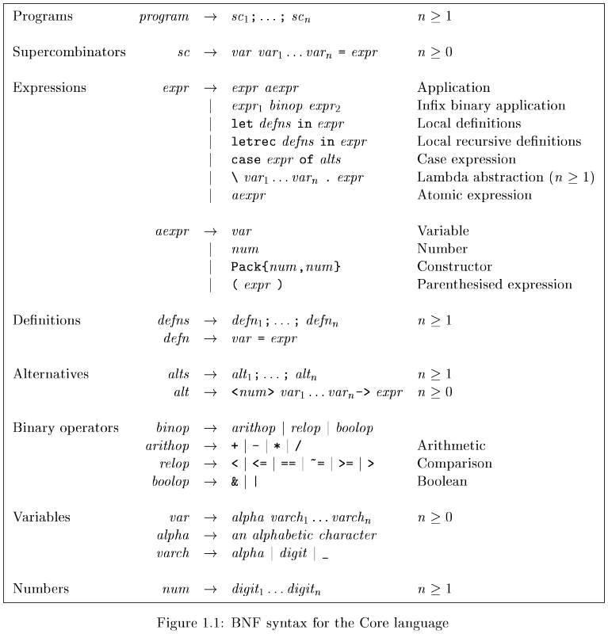

# fcore

A Haskell implementation of the Core functional programming language from SPJ's "Implementing Functional Languages" book

## Core language overview

A Core language program is a set of *supercombinator definitions*, with an entry point named `main`, e.g.:
```hs
main = double 21
double x = x + x
```

Supercombinators can have local definitions via `let` (non-recursive) and `letrec` (recursive):
```hs
quadruple x = let twice_x = x + x
               in twice_x + twice_x
infinite n = letrec ns = ons n ns
             in ns
```



### Lambdas
```hs
double_list xs = map (\ x . 2*x) xs
```

### Data types
Data types are represented uniformly with a family of constructors:
```hs
Pack{tag,arity}
```

For example:
```
Red = Pack{1,0}
Green = Pack{2,0}
Blue = Pack{3,0}

Rect = Pack{4,2}
Polar = Pack{5,2}

Leaf = Pack{6,1}
Branch = Pack{7,2}

MkNumPair = Pack{8,2}
```

So, in Core, instead of:
```hs
Branch (Leaf 3) (Leaf 4)
```
one would write:
```hs
Pack{7,2} (Pack{6,1} 3) (Pack{6,1} 4)
```

This, of course, is easily extendable to actual type names through a map of types to `Pack`s, but this is just an implementation detail.

### Pattern matching
Patern matching is performed via the `case` expression that takes a tag and an arbitrary number of arguments:
```hs
Red = Pack{1,0}
Green = Pack{2,0}
Blue = Pack{3,0}

isRed c = case c of
    <1> -> True ;
    <2> -> False ;
    <3> -> False

Leaf = Pack{1,1}
Branch = Pack{2,2}

depth t = case t of
    <1> n -> 0 ;
    <2> t1 t2 -> 1 + max (depth t1) (depth t2)
```

### Operators
| Precedence | Asociativity | Operator        |
|------------|--------------|-----------------|
| 6          | Left         | Application     |
| 5          | Right        | *               |
|            | None         | /               |
| 4          | Right        | +               |
|            | None         | -               |
| 3          | None         | == ~= > >= < <= |
| 2          | Right        | &               |
| 1          | Right        | \|              |

*Note*: Unary `-` is provided via the `negate` function.

